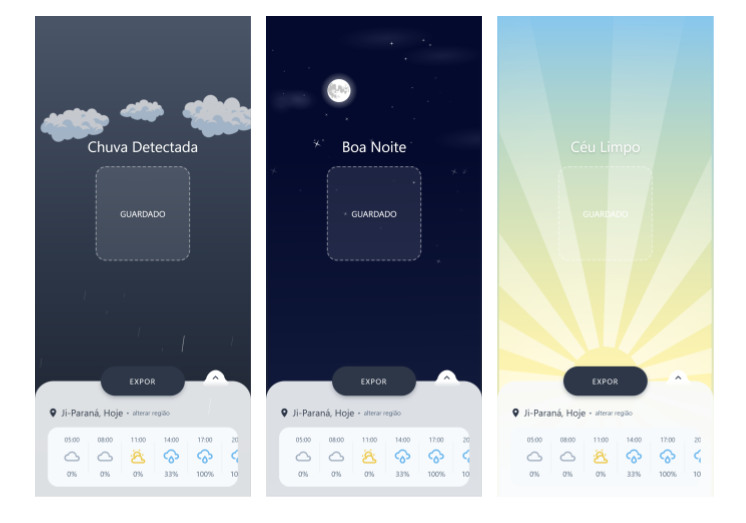
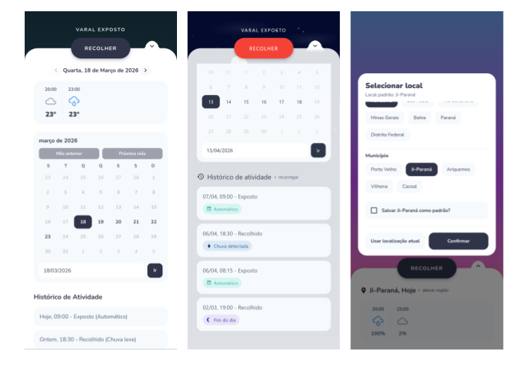
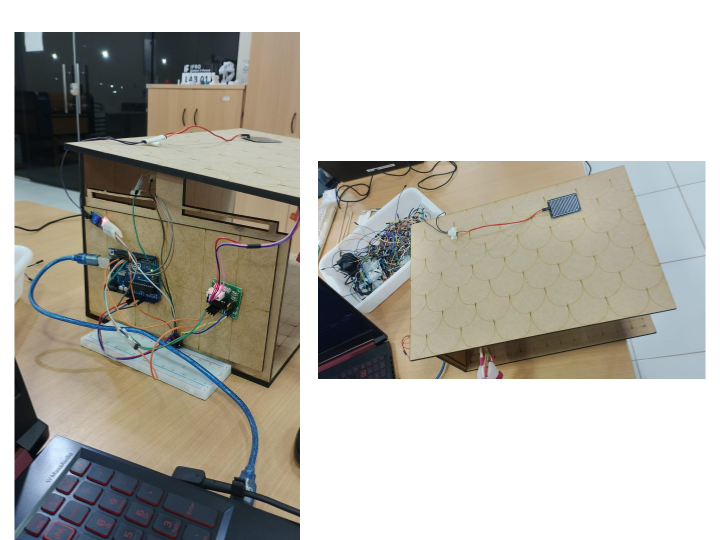
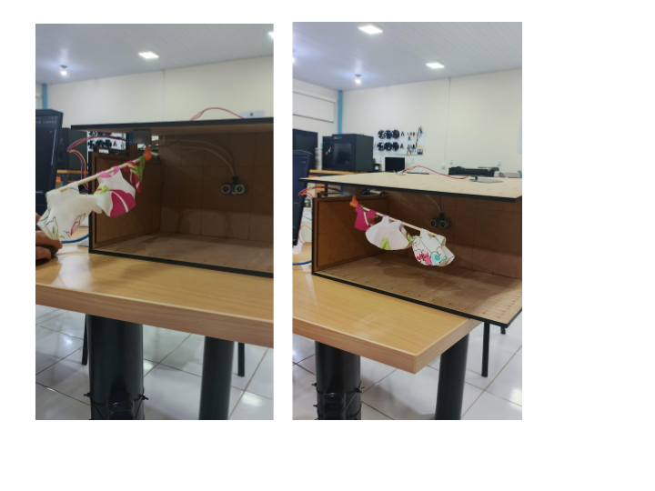

<div align="center">
   <a href="">
    
  </a>
   <h2 align="center">Guarda-roupa</h2>
   <p align="center">
      App mobile que salva suas roupas antes que seja tarde demais.
   </p>
</div>

<div align="center">
   <a href="https://reactnative.dev/">
      
   </a>
   <a href="https://expo.dev/">
      
   </a>
   <a href="https://developer.mozilla.org/pt-BR/docs/Web/JavaScript">
      
   </a>
   <a href="https://isocpp.org/">
      
   </a>
</div>

<br>

<div align="center">
   <a href="#sobre-o-projeto">Sobre</a> &#xa0; • &#xa0;
   <a href="#instalação">Instalação</a> &#xa0; • &#xa0;
   <a href="#changelog">Changelog</a>&#xa0; • &#xa0;
   <a href="#aviso-legal-e-licença">Aviso legal e Licença</a>
</div>

---

## Sobre o projeto

O **Guarda-roupa** é um aplicativo mobile que resolve um problema cotidiano: recolher ou expor roupas no varal sem depender de "achismos" sobre o tempo antes de ser tarde demais.

A ideia central é combinar uma **API de clima em tempo real** com um **módulo Arduino físico** e o controle por aplicativo para automatizar de forma inteligente a decisão de expor e recolher roupas no varal.

### Funcionalidades

- Tela principal com animações de fundo dinâmicas, baseadas na condição climática real e horário do dia.
- Menu recolhido:
    - Texto info de **Data + local** e seção com previsão horária via OpenWeatherMap
    - Seleção de região por modal:
        - Fluxo País → Estado → Município.
        - Opção de definir **local padrão**.
- Botão flutuante **RECOLHER / EXPOR** na divisa do menu, com animação de linhas irradiando.
- Menu expandido:
    - Seção de **calendário**:
        - Escolha de dia.
        - Previsão horária filtrada com base no mesmo payload.
    - Seção de **Histórico do varal**:
        - Registro de mudanças entre recolhido/expandido.
        - Identificação da origem da mudança (manual, automático, chuva ou fim do dia).
- Integração em tempo real com módulo Arduino via API local:
    - Leitura periódica de status do varal (**estendido**, **chuva**, **roupa detectada**).
    - Leitura ativa de comandos do botão **RECOLHER / EXPOR**
- Regras de segurança no controle do varal:
    - Confirmação para estender em caso de chuva.
    - Confirmação quando não há roupa detectada.

<div align="center">
  <p>
    
    
  </p>
</div>

### Tecnologias utilizadas

#### Core e navegação

<a href="https://reactnative.dev/">
   
</a>
<a href="https://expo.dev/">
   
</a>
<a href="https://expo.github.io/router/">
   
</a>

#### Interface e animações

<a href="https://docs.swmansion.com/react-native-reanimated/">
   
</a>
<a href="https://github.com/react-native-svg/react-native-svg">
   
</a>
<a href="https://github.com/lottie-react-native/lottie-react-native">
   
</a>
<a href="https://docs.expo.dev/versions/latest/sdk/linear-gradient/">
   
</a>
<a href="https://icons.expo.fyi/">
   
</a>
<a href="https://fonnts.com/croogla-4f/">
  
</a>

#### Dependências externas

<a href="https://github.com/react-native-async-storage/async-storage">
   
</a>
<a href="https://expressjs.com/">
   
</a>
<a href="https://axios-http.com">
   
</a>
<a href="https://serialport.io/">
   
</a>
<a href="https://openweathermap.org/api">
   
</a>
<a href="https://docs.expo.dev/versions/latest/sdk/location/">
   
</a>

#### Hardware e embarcados

<a href="https://www.arduino.cc/">
   
</a>

<div align="left">
   <h6><a href="#guarda-roupa"> Voltar para o início ↺</a></h6>
</div>

## Instalação

### Iniciando o projeto

> [!IMPORTANT]
> Certifique-se de ter os seguintes requisitos antes de iniciar:
>
> <a href="https://nodejs.org/">
>    
> </a>
> <a href="https://www.npmjs.com/">
>    
> </a>
> <a href="https://expo.dev/">
>    
> </a>

1. Clone o repositório

```bash
git clone https://github.com/seu-usuario/guardaRoupaApp.git
cd guardaRoupaApp
```

2. Instale as dependências do projeto

```bash
npm install
```

3. Instale o Expo CLI globalmente (caso não tenha)

```bash
npm install -g expo-cli
```

4. Inicie o projeto

```bash
npm start
```

> [!NOTE]
> O comando `npm start` foi configurado para abrir o Expo em modo túnel por padrão.

5. Para abrir no navegador desktop, pressione `w`.

6. Para configurar o teste em celular físico, leia [Ajuste de rede para teste em celular físico](#3-ajuste-de-rede-para-teste-em-celular-físico).

<div align="left">
   <h6><a href="#guarda-roupa"> Voltar para o início ↺</a></h6>
</div>

### API de clima (OpenWeatherMap)

O app usa a API **OpenWeatherMap**. Sem chave, a previsão não carrega.

1. Crie uma conta em [openweathermap.org/api](https://openweathermap.org/api) e gere uma **API key** (plano gratuito já satisfaz casos de teste do app).
2. Na raiz do projeto, copie o exemplo e crie o arquivo `.env`:

    ```bash
    cp .env.example .env
    ```

3. Edite `.env` e defina:

    ```
    EXPO_PUBLIC_OWM_API_KEY=sua_chave_aqui
    ```

4. **Reinicie o bundler** (`Ctrl+C` e `npm start` de novo). Variáveis `EXPO_PUBLIC_*` só entram após reiniciar o Expo.

5. No dispositivo/emulador, **permita localização** quando o app pedir (o clima usa GPS).

<div align="left">
   <h6><a href="#guarda-roupa"> Voltar para o início ↺</a></h6>
</div>

### Módulo Arduino (API local + firmware + hardware)

O controle físico do varal funciona em 3 camadas:

1. **App Expo** envia/consulta estado via HTTP
2. **API local Node/Express** (ponte serial) converte HTTP para comandos da serial
3. **Arduino** executa a lógica embarcada, controla os sensores/motor envia o estado pela comunicação serial

```
                     HTTP
┌──────────────┐               ┌─────────────┐
│ React Native │ ────────────► │ API Express │
│     App      │ ◄──────────── │   :3000     │
└──────────────┘               └──────┬──────┘
                                      │
                                   Serial
                                    9600
                                      │
                                      ▼
                                 ┌─────────┐
                                 │ Arduino │
                                 └────┬────┘
                                      │
                     ┌────────────────┼────────────────┐
                     ▼                ▼                ▼
                  HC-SR04           HL-83           28BYJ-48
                  Roupas            Chuva             Motor
```

#### 1) Suba o firmware no Arduino

- Abra o arquivo `Arduino/Arduino.ino` na IDE do Arduino
- Conecte o hardware (motor de passo + sensor ultrassônico + sensor de chuva)
- Faça upload para a placa

#### 2) Configure e rode a API local

1. Ajuste a porta serial no arquivo `Arduino-api/server.js` (ex.: `COM3`, `COM9`, `/dev/ttyACM0`)
2. Inicie a API na raiz do projeto:

    ```bash
    node Arduino-api/server.js
    ```

3. A API sobe na porta `3000` com endpoints:
    - `GET /status` → retorna `{ estendido, chuva, roupa }`
    - `POST /command` com `{ "action": "E" }` ou `{ "action": "R" }`

#### 3) Ajuste de rede para teste em celular físico

- Se quiser testar com seu celular, defina `EXPO_PUBLIC_ARDUINO_API_URL` no `.env` com o IP da máquina que roda a API, não com `localhost` (ex.: `http://10.50.64.251:3000`).
- Celular e computador precisam estar na mesma rede local ou na mesma VPN que alcance esse IP
- Depois de alterar o `.env`, reinicie o Expo com cache limpo para recompilar as variáveis públicas
- Para abrir e testar, use o **Expo Go** no celular:

<div align="left">
   <a href="https://apps.apple.com/app/expo-go/id982107779" target="_blank" rel="noopener noreferrer">
      
   </a>
   <a href="https://play.google.com/store/apps/details?id=host.exp.exponent" target="_blank" rel="noopener noreferrer">
      
   </a>
</div>

1. Instale o Expo Go (App Store ou Google Play).
2. Rode `npm start` na raiz do projeto.
3. Abra o Expo Go no celular e escaneie o QR code mostrado no terminal.

#### 4) Protocolo serial usado

- `E`: estender varal
- `R`: recolher varal
- `S`: solicitar status atual
- Resposta do Arduino: JSON em linha única, por exemplo:

    ```json
    { "estendido": true, "chuva": false, "roupa": true }
    ```

#### 5) Hardware e componentes

| Componente            | Qtd. | Função      | Descrição                                                                                   | Link                                                                                                                                                                                                                                                                                   |
| --------------------- | ---: | ----------- | ------------------------------------------------------------------------------------------- | -------------------------------------------------------------------------------------------------------------------------------------------------------------------------------------------------------------------------------------------------------------------------------------- |
| Arduino UNO           |    1 | Controle    | Microcontrolador principal do sistema embarcado.                                            | [Arduino Store](https://store.arduino.cc/collections/uno/products/arduino-uno-rev3)                                                                                                                                                                                                    |
| HC-SR04               |    1 | Detecção    | Sensor ultrassônico utilizado para detectar a presença de roupas.                           | [Mercado Livre](https://www.mercadolivre.com.br/case-hcsr04-com-tampa--suporte-sensor-ultrassonico-arduino/up/MLBU3961484300?pdp_filters=item_id%3AMLB6745051264&matt_tool=38524122#origin=share&sid=share&wid=MLB6745051264&action=copy)                                              |
| HL-83                 |    1 | Detecção    | Sensor utilizado para detectar chuva/umidade.                                               | [Mercado Livre](https://www.mercadolivre.com.br/sensor-de-chuva-com-rele/up/MLBU1718489592?pdp_filters=item_id%3AMLB1946113427&matt_tool=38524122&ua=2GpmuqXo4k9QWwFuXkpwHTkX7aBoWvXpJ1U_pkjFtbTyyUyj#origin=share&sid=share&wid=MLB1946113427&action=copy)                            |
| 28BYJ-48              |    1 | Atuador     | Motor de passo responsável pela movimentação do varal.                                      | [Mercado Livre](https://www.mercadolivre.com.br/motor-de-passo-28byj-48-driver-uln2003-arduino-robotica/p/MLB32493377?pdp_filters=item_id%3AMLB3774275425&matt_tool=38524122&ua=vlZk0aTLEQU31QFYQsCgoZl9pWYv5UYNN4JkSJ-uIfZQHpAN#origin=share&sid=share&wid=MLB3774275425&action=copy) |
| Protoboard 830 pontos |    1 | Montagem    | Base para montagem das conexões eletrônicas.                                                | [Mercado Livre](https://www.mercadolivre.com.br/protoboard-830-pontos-mb-102-placa-de-ensaio-eletronica/p/MLB28453899?pdp_filters=item_id%3AMLB5289141526&matt_tool=38524122&ua=FKHpu0bsADolJHW5bxgtKWP-L_vkt3cbdJIZ6TM_lIMpd2wC#origin=share&sid=share&wid=MLB5289141526&action=copy) |
| Cabo USB 3.0 A/B      |    1 | Comunicação | Cabo utilizado para conectar o Arduino ao computador para programação e comunicação serial. | [Mercado Livre](https://www.mercadolivre.com.br/cabo-extensor-30-usb-macho-x-femea-blindado-1-metro/up/MLBU761551036?pdp_filters=item_id%3AMLB3332476705&matt_tool=38524122&ua=AcIKkO2h_3XowjPdoyE9cdFl9EQA4G668nq3fzt0SGVfRtc5#origin=share&sid=share&wid=MLB3332476705&action=copy)  |

<div align="center">
  <p>
    
    
  </p>
</div>
  
<div align="left">
   <h6><a href="#guarda-roupa"> Voltar para o início ↺</a></h6>
</div>

## Changelog

O projeto mantém um histórico de alterações detalhado para cada versão, incluindo:

- Novas funcionalidades adicionadas
- Alterações em funcionalidades existentes
- Correções de bugs

Consulte o [CHANGELOG.md](CHANGELOG.md) para ver o histórico completo de alterações.

<div align="left">
   <h6><a href="#guarda-roupa-app"> Voltar para o início ↺</a></h6>
</div>

## Aviso legal e Licença

### Aviso legal

Este projeto possui um aviso legal de propriedade intelectual, **registro de programa de computador no INPI** e diretrizes de uso institucional do nome e da tecnologia do projeto.

Veja o arquivo [NOTICE.md](NOTICE.md) para mais detalhes.

### Licença

Este projeto esta licenciado sob a **Guarda-Roupa Non-Commercial License v1.0**.

Veja o arquivo [LICENSE](LICENSE) para mais detalhes.

> [!NOTE]
> Resumo prático da licença:
>
> - **Permitido**: uso pessoal, acadêmico, estudo, modificação e compartilhamento sem fins comerciais.
> - **Proibido sem autorização**: qualquer uso comercial, venda, sublicenciamento ou monetização direta/indireta do código e de derivados.

<div align="left">
   <h6><a href="#guarda-roupa-app"> Voltar para o início ↺</a></h6>
</div>
